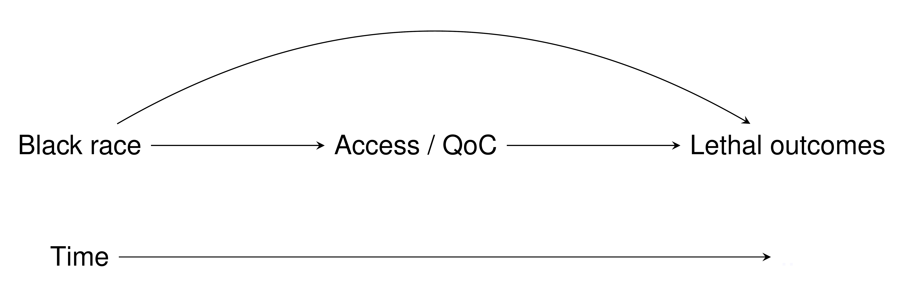

```{r xaringan-themer, include = FALSE}
library(xaringanthemer)
duo_accent(primary_color = "#F09749", secondary_color = "skyblue")
# mono_accent(base_color = "skyblue")
```

```{r setup, include=FALSE}
knitr::opts_chunk$set(
  fig.width = 10, fig.height = 6, fig.retina = 2,
  warning = FALSE, message = FALSE
)

xaringanExtra::use_xaringan_extra(c("animate_css", "text_poster", "panelset"))
xaringanExtra::use_tachyons()
```

class: center middle hide-count hide-logo
background-image: url(figures/moffittlogo.png) 
background-size: 15%
background-position: bottom 5% right 5%

<div class="talk-logo"></div>

.talk-meta[
  .talk-title[# mediator <br> <br> .smaller[an R package for conducting <br> causal mediation analyses]]

  .talk-author[Jordan Creed]
  
  .talk-date[ @jhcreed]
]

---

## Mediation analysis

Examines an exposure and outcome through an intermediate variable (mediator) 

Causal relationship 
+ Understanding the mechanics behind an association 
+ NOT prediction
    
Estimate the direct and indirect effects 

.h-center[

]

---

## Diected Acyclic Graphs (DAGs)

.w-75.h-center[

]

DAGs contain variables of interest and common causes

Time ordered 

Quickly assess assocations between variables 

Rules for reading DAGs 
+ .accent-blue[ Modern Epidemiology - Chapter 12 ]
+ .accent-blue[ Causal Inference - https://www.hsph.harvard.edu/miguel-hernan/causal-inference-book/ ] 

---

## Classic mediation analysis

Baron and Kenny aka the product method 
+ https://www.sesp.org/files/The%20Moderator-Baron.pdf
+ Over 90,000 citations 

Criteria to be a mediator: 
+ Changing the exposure change the mediator (Race -> Access/ QoC) 
+ The mediator affect the outcome (Access / Qoc -> Lethal outcomes)
+ Changing the exposure change the outcome .accent-blue[ (... unless the indirect and direct effects cancel out) ]
+ After controlling for the mediator, the previously significant relationship between the exposure and the outcome is no longer significant .accent-blue[ (... unless it partial mediaton) ]

Limitation : Does not accommodate exposure-mediator interactions

---
class: center middle methods-title

`r xaringanExtra::text_poster(
  "Causal 
  Inference 
  Methods",
  width = "90%",
  height = "80%"
)`

```{css echo=FALSE}
.strive-to-recruit .text-poster .line-container {
  color: #000000;
}
.methods-title {
  background: #87CEEB;
}
```

---

## Mediator != confounder

<!-- example of JAMA paper with bad mediator -->


```{css, echo=FALSE}
.talk-logo {
  width: 480px;
  height: 556px;
  position: absolute;
  top: 5%;
  left: 50%;
  background-image: url('figures/mediator_hex.png');
  background-size: cover;
  background-repeat: no-repeat;
}
.talk-meta {
  #font-family: Overpass;
  position: absolute;
  text-align: left;
  bottom: 10px;
  left: 25px;
}
.talk-author {
  color: #444;
  font-weight: bold;
  font-size: 1.5em;
  line-height: 1em;
}
.talk-date {
  color: #666;
  font-size: 1.25em;
  line-height: 0;
}
.hide-count .remark-slide-number {
  display: none;
}

# sizing 
.w-50 {
  width: 50%;
}
.w-75 {
  width: 75%;
}
.h-center {
  margin: 0 auto;
}

# colors
.accent-orange { 
  color: "#F09749"; 
}
.accent-blue { 
  color: skyblue; 
}

```