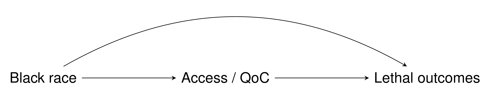

```{r xaringan-themer, include = FALSE}
library(xaringanthemer)
duo_accent(primary_color = "#F09749", secondary_color = "skyblue")
# mono_accent(base_color = "skyblue")
```

```{r setup, include=FALSE}
knitr::opts_chunk$set(
  fig.width = 10, fig.height = 6, fig.retina = 2,
  warning = FALSE, message = FALSE
)

xaringanExtra::use_xaringan_extra(c("animate_css", "text_poster", "panelset"))
```

class: center middle hide-count hide-logo
background-image: url(figures/moffittlogo.png) 
background-size: 22%
background-position: bottom 5% right 5%

<div class="talk-logo"></div>

.talk-meta[
  .talk-title[# mediator <br> <br> .smaller[an R package for conducting <br> causal mediation analyses]]

  .talk-author[Jordan Creed]
  
  .talk-date[ @jhcreed]
]

---

## Mediation analysis

Examines an exposure and outcome through an intermediate variable (mediator) 

Causal relationship 
+ Understanding the mechanics behind an association 
+ NOT prediction
    
Estimate the direct and indirect effects 

.w-50.h-center[

]

---

## Intro to DAGs

---

## Is it a mediator or a confounder? 

<!-- example of JAMA paper with bad mediator -->

--- 

## Baron and Kenny but more ...

```{css, echo=FALSE}
.talk-logo {
  width: 480px;
  height: 556px;
  position: absolute;
  top: 5%;
  left: 50%;
  background-image: url('figures/mediator_hex.png');
  background-size: cover;
  background-repeat: no-repeat;
}
.talk-meta {
  #font-family: Overpass;
  position: absolute;
  text-align: left;
  bottom: 10px;
  left: 25px;
}
.talk-author {
  color: #444;
  font-weight: bold;
  font-size: 1.5em;
  line-height: 1em;
}
.talk-date {
  color: #666;
  font-size: 1.25em;
  line-height: 0;
}
.hide-count .remark-slide-number {
  display: none;
}

# sizing 
.w-50 {
  width: 50%;
}
.h-center {
  margin: 0 auto;
}
```