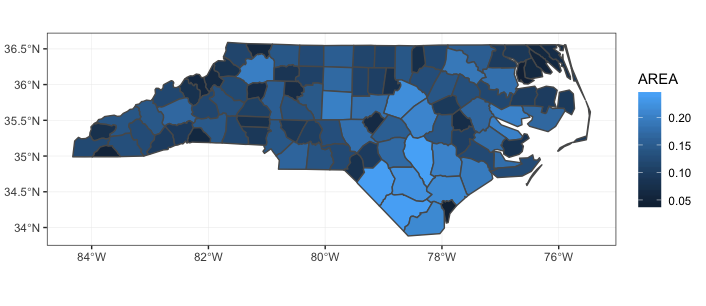
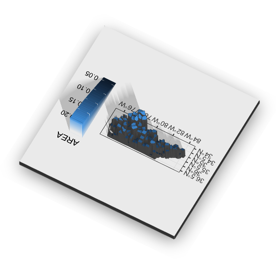
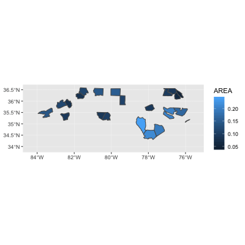

```{r setup, include=FALSE}
knitr::opts_chunk$set(echo = TRUE,
                      fig.align = "center",
                      tidy.opts=list(width.cutoff=80) #,
                      # tidy=TRUE
                      )
library(animation)
ani.options(width=150, height=150)
```

<!-- ## denotes title of new slide -->

## Packages to know 

- maps/mapdata
- sf 
- tidyverse/ggplot2

**Fun packages**

- rayshader
- gganimate 

```{r load_packages, echo = FALSE, message=FALSE, warning=FALSE}
library(tidyverse)
library(maps)
library(ggmap)
library(sf)
library(rayshader)
library(gganimate)
```

# Quick Start

## Data frames from outlines 

- `maps` and `mapdata` packages provide basic outlines for common maps (e.g. county maps)

```{r maps_pack, fig.width=2, fig.height=2}
cnty_list <- map('county', plot = FALSE)
str(cnty_list)
```

## Data frames from outlines

- `map_data` from ggplot2 takes these outlines and returns a data frame for plotting

```{r maps_data}
cnty <- ggplot2::map_data("county") # "county" comes from `maps`
head(cnty) # only continental US - no alaska or hawaii
```

## maps and ggplot

```{r base_map, fig.width=3.5, fig.height=3.5}

base_p <- ggplot(subset(cnty,region=="florida"),
                 aes(long,lat,group=group)) +
  geom_polygon(aes(fill=as.factor(group)),
               show.legend = FALSE, colour=NA)

base_p

```

## Map projections

- how the world is mapped in 2D
- more important as the area increases

```{r coord_system, fig.width=4, fig.height=4}

base_p + coord_map("bonne", param=45)

```

## Map zoom {.columns-2}

Wrong:
```{r zoom_wrong, fig.width=3, fig.height=3}
base_p + 
  xlim(-83, -82) + 
  ylim(27,29)
```


Right:
```{r zoom, fig.width=3, fig.height=3}
base_p + 
  coord_fixed(xlim = c(-83, -82),
              ylim = c(27, 29))
```

## Additional geoms {.columns-2}

```{r adding_f, fig.width=4, fig.height=4, echo=FALSE}

random_points <- data.frame(lat = sample(cnty[cnty$region=="florida",]$lat,
                                   20, replace = TRUE),
                            lon = sample(cnty[cnty$region=="florida",]$long,
                                   20, replace = TRUE))

base_p + 
  geom_point(data = random_points,
             aes(x = lon,y = lat,
                 group=1:20)) + 
  geom_hline(yintercept = 28) + 
  theme_classic() + 
  ggtitle("nonsense points")

```

Normal plotting in ggplot but x is always longitude any y is always latitude
```{r adding_f_display, eval=FALSE}
base_p + 
  geom_point(data = random_points,
             aes(x = lon,y = lat,
                 group=1:20)) + 
  geom_hline(yintercept = 28) + 
  theme_classic() + 
  ggtitle("nonsense points")
```

# sf package

## What is sf?

- sf stands for simple features and is a standard for storing spatial geometry of features
  - features are basically an object : it can be a tree or a whole forest
  - geometry is where on Earth a feature is 
- super popular in spatial databases
    - GeoJSON
    - GIS
    
<!-- add table containg common feature types? -->
    
## Reading shapefiles (*.shp)

```{r import_shp}

nc <- sf::st_read(system.file("shape/nc.shp", package = "sf"),
                  quiet = TRUE)
class(nc)

nc2 <- sf::read_sf(system.file("shape/nc.shp", package = "sf"),
                   quiet = TRUE)
class(nc2)

```

----

```{r examine_shp}
nc[1:5,]
```

## sf and ggplot 

**Warning**: can be slow with large shapefiles

```{r sf_plot, fig.width=4.5, fig.height=4.5}
fig1 <- ggplot(nc) + 
  geom_sf(aes(fill = AREA)) +
  theme_bw()
```



# Not your mother's maps

## 3D - rayshader

```{r 3dcreate, eval=FALSE}

# create 3D image
plot_gg(fig1)

# static image of 3D project
render_snapshot()

```

<center>
{width=50px}
</center>

## Animated - gganimate

```{r animate_code, fig.width=4.5, fig.height=4.5, eval=FALSE}
nc$GROUP <- sample(1:4, nrow(nc), replace=TRUE)

animate(ggplot() + 
  geom_sf(data = nc, aes(fill=AREA)) +
  transition_states(GROUP,3,1), width = 400, height = 400)
```

<center>

</center>

## ggmap

# Thank You!

## Tampa Bay R Users

<center>
{width=50px}
</center>

